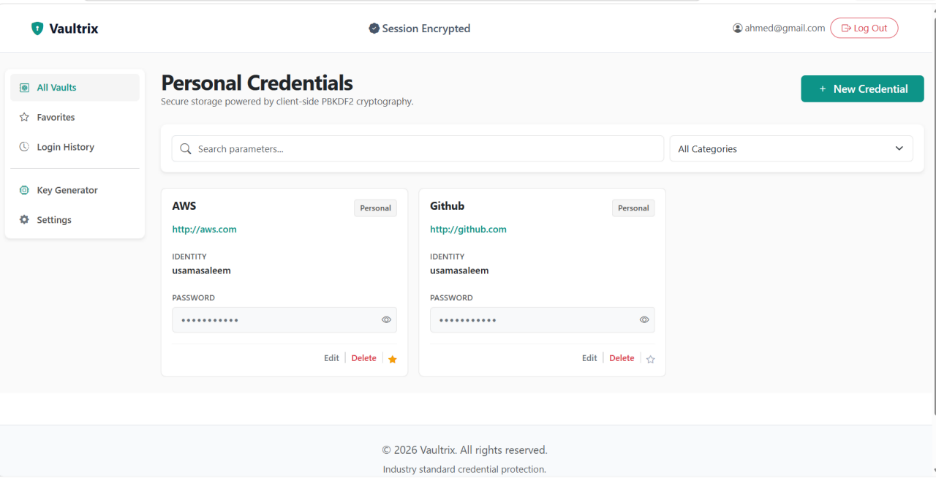
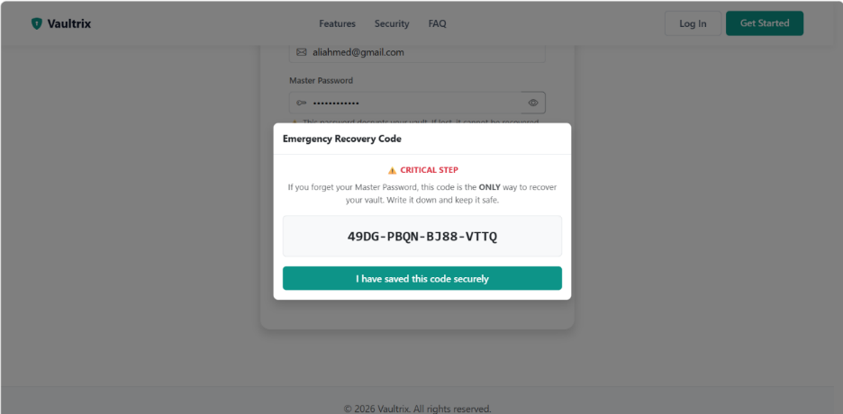
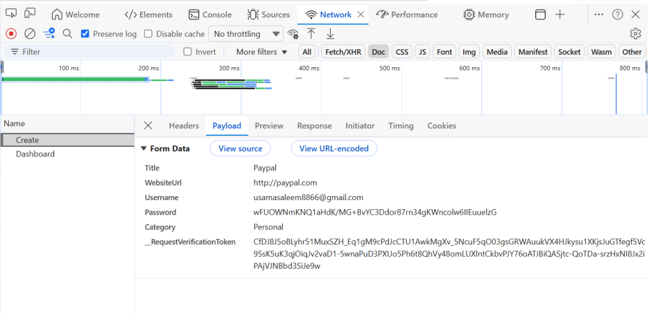
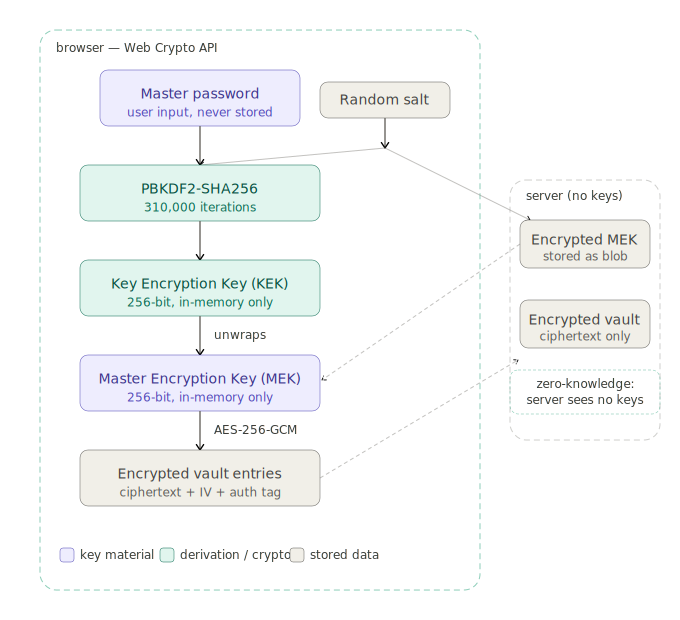

# Vaultrix — Zero-Knowledge Password Manager

A fully functional browser-encrypted password manager built with ASP.NET Core 10.0 MVC.
The server stores only encrypted ciphertext — it is architecturally incapable of reading your passwords.

## Tech Stack

- **Backend:** ASP.NET Core 10.0 MVC, C#
- **ORM:** Entity Framework Core + SQLite
- **Auth:** ASP.NET Core Identity (cookie-based)
- **Frontend:** Bootstrap 5, Vanilla JavaScript
- **Cryptography:** Web Crypto API (window.crypto.subtle)

## How It Works

Vaultrix implements a Two-Tier Key Architecture:

- A random **Master Encryption Key (MEK)** encrypts all vault items using AES-256-GCM
- The MEK is locked by a **Key Encryption Key (KEK)** derived from your master password via PBKDF2 (100,000 iterations)
- A second copy of the MEK is locked by a recovery code KEK for account recovery
- The server only ever stores encrypted blobs — zero plaintext credentials

## Screenshots

### Dashboard


### Registration


### Network Tab — Encrypted Payload


## Architecture



## Security Features

- AES-256-GCM authenticated encryption
- PBKDF2-SHA256 with 100,000 iterations
- sessionStorage key scoping (destroyed on tab close)
- 5-minute inactivity auto-lock
- CSRF protection on all POST endpoints
- Cryptographically secure backend password generator
- Audit logging of all security events

## Running Locally

```bash
git clone https://github.com/osaamasaleem/vaultrix.git
cd vaultrix
dotnet restore
dotnet run
```

Open `https://localhost:5001` in your browser.

